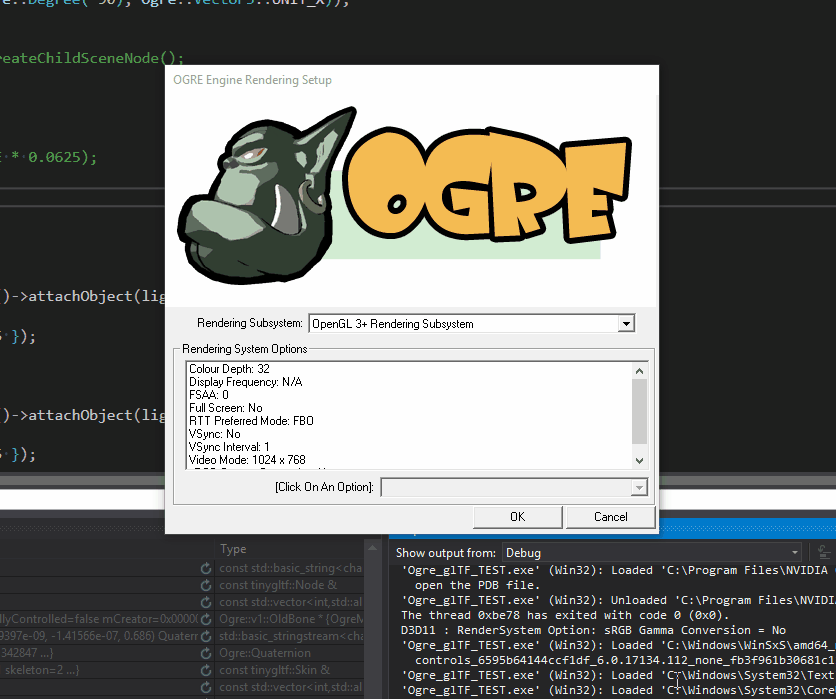

# Ogre_glTF


[Project public taskboard](https://phabricator.polutropon.games/project/board/4/)

Library and Plugin to use glTF 2.0 resources with Ogre 2.1 licencied under the terms of the [MIT licence](https://opensource.org/licenses/MIT "MIT Licence on the OSI website")


*Loading an object with a PBR material as HLMS/PBS datablock*


*Loading of an object with skeletal animation*




## Requirements


 - Ogre 2.1 built for source (lattest commit available)
 - C++14 compliant compiler (any modern-ish version of Visual Studio or GCC will do)
 

`CI` builds are currently performed on Windows under Visual Studio 2017 and on Linux under g++7

(please, do not attempt to do the thing the travis script does directly under linux, unless you really think extracting random archives inside of `/` is wise :wink:)


## How to use


- Get the source code with `git clone https://github.com/Ybalrid/Ogre_glTF --recursive`
 - Build the library with CMake, using the `build` subdirectory, and get the `Ogre_glTF.dll`/`libOgre_glTF.so` file (instructions below)
 - Point your compiler to the public headers (the /include directory of the repository), or copy them to your project
 - Point Ogre to use Ogre_glTF as a plugin in the same way you'll do to the other (e.g. RenderSystems, using plugin.cfg, ...)
 - You can put binary glTF files (GLB files) inside your resources, like you would do with .mesh/.skeleton/textures files
 - In your code:
 

```cpp
//Get access to the gltf loader, and load a GLB file in the resources to an item
//This actually search through the list of installed plugin, keep that pointer somewhere convinient
auto glTFLoader = gltfPluginAccessor::findPlugin()->getLoader(); 

//You can creae an Item for a scene by giving the name of the GLB file to look for in the resources
Ogre::Item* cesiumMan = glTFLoader->getModelData("CesiumMan.glb", glTFLoaderInterface::LoadFrom::ResourceManager).makeItem(smgr);
```

In case you cloned without `--recursive`, `cd` into the `Ogre_glTF` directory and use `git submodule update --init --recursive` to download dependencies correctly.


## Building the source code


First of all, locally clone this repository. It uses git submodules to get it's dependencies, so you just need to do 


```bash
git clone --recursive https://github.com/Ybalrid/Ogre_glTF
```


This project uses CMake. The CMake directory is a simple copy of every cmake script shipped in the Ogre SDK, to make things simpler.

You should get and install Ogre 2.1 from source on your system, some help can be found here: https://forums.ogre3d.org/viewtopic.php?f=25&t=92874

To build the project, you need to have Ogre 2.1 build and "installed" somewhere. Windows users may need to build the INSTALL target of Ogre and then to set the `OGRE_HOME` variable to the "build/sdk" folder. Linux users, you can `make install` Ogre in /usr/local

then, do the folliwng (linux) :

```bash
cd build
cmake ..                        #execute CMake while pointing at the parent directory
make                            #build the library and the demo program

#to be able to run the demo program as-is, do the following:
cp -r <path to HLMS> .          #add the Hlms shader code that comes with Ogre
cp <path to ogre plugins>/* .   #add the necessary plugins (RenderSystem_GL3+)
```


On a typical install from Ogre's source code on linux, theses path are `/usr/local/share/OGRE/Media/Hlms` and `/usr/local/lib/OGRE/*` respectively

(windows) :


 - Use cmake-gui to generate a Visual Studio solution inside the `build` using the same version that you built Ogre with. You probably need to set the `OGRE_HOME` variable.
 - Open the .sln (solution) file into Visual Studio. You'll get 2 projects : `Ogre_glTF` (the DLL) and `Ogre_glTF_TEST` (a test program)
 - To make the test program works, copy inside the "build" directory all the .dll (and .pdb if you want to debug) files from Ogre's debug and release binary directories
 - Copy the HLMS libary to the "build" directory
 
 
The "test" program is really crude and badly written, it was to validate that some of the features were working during development.


## Project details

The goal is to be able to load the geometry, the PBR material and the animations of an object from glTF and use Ogre's classes as if you just got the object as a .mesh from Ogre's resource manager.

The curent code is limitted into loading the first declared mesh in a glTF file, or, if the glTF file has multiple "secenes", and has a "default scene" value, it will take the mesh attached to the fist node of the default scene.

Think of it as replacing `.mesh` files with binary `.glb` files, that are a standard format, with clear material/skeleton/animation/textures definitions enclosed, and with official exporters that works according to an industry-standard specification.

I'm wanting to get this functionality working inside my game engine (Annwvyn, a VR application developement framework that uses Ogre), and specifically I want to be able to use the glTF official Blender exporter.

The user facing API hasn't been worked on quite well, the only thing that has been cared on is to follow a pImpl (compillation firewall) pattern to hide to your code the dependencies in this library.

This library is based on tinygltf. https://github.com/syoyo/tinygltf. tinygltf itsefl vendor in some other opensource projects, like stb_image and a json loading library.


## Features


This project is currently in developement, here's a list of features that we are working on, ticked items means that the feature is implemented.

 - [x] Load mesh infrmation (index and vertex buffer, including vertex coordinates, normal vectors, texture coordinates) and create an Ogre::Mesh out of it via Ogre::MeshManager and Ogre::VaoManager
 - [x] Load Image information from glTF into Ogre::TextureManager
 - [x] Load PBR material definition form glTF and create coresponding Ogre::HlmsPbsDatablock for them. (Ogre call PBR "PBS", more or less)
 - [x] Load "skin" information from glTF and create corresponding Ogre::Skeleton for the mesh
 - [x] Loop through all the vertex <-> bone assignement to get a valid skeleton configuration
 - [x] Load animation information and create animations from them
 - [ ] ~~Load mesh "target" information and create Ogre "morph" target from them~~ (Ogre 2.1 doesn't support them yet)
 - [x] Load `.glb` files from Ogre's resource manager
 - [ ] Load `.gltf` from Ogre's resource manager (Not really practical as it relies on URIs and path to resources. It is probably easier to manage and more efficient to stick with `.glb` in an offline workflow)
 - [x] Being able to "load" and "install" this as an actual Ogre plugin


## Known issues


 - There's a problem with loading normal map data with the Direct 3D 11 render system of Ogre [issue #2](https://github.com/Ybalrid/Ogre_glTF/issues/2)
 - There's several little issues with the texture loading. A small refactor would help. See the TODO comments.
 - Library is not "installable" from CMakeLists.txt yet. Users need to get the .dll / .so file accessible to their program, and point their compiler to look for headers the "include" directory
 - Can only load one mesh and it's associated material in a file. Will either load the first one, of the fist node of the default scene, depending if the default scene is set
 - Library only has been tested on an handfull of glTF files, so some corner cases may make it not work.

 
## Contributors


This project is Open Source. If you can improve it in any way, Pull Requests are welcommed!
 

Here's the list of the contributors that hepled out with this projet:
  - [Crashy](https://twitter.com/LMCrashy) helped figure out how to correctly bind the skeleton base pauses, and how to get relative transform in the keyframes
  - [Matt Chang](https://github.com/chchwy) Fixes in mesh loading
  - [jprajala](https://github.com/jprajala) added multi material loading for model files. Fixed bouding box issue where object will have the AABBs of the *last* loaded primitive. (now bounding box are merged together when model has multiple primitives.)
  - [Stig Atle](https://twitter.com/stigatle) @stig-atle
  - [Stuggy](https://github.com/Stuggy) Implemented the retreival of node local transform, if you just want a model, but has to apply the scene nodes transform on them
  - [Matías](https://twitter.com/matiasgoldberg) being the main author/maintainer of the Ogre 2.x for awnsering countless silly questions over twitter, gitter and the forums... ^^"


## Notes on third party components


`tinygltf` is an header only library. It is included in this very repository via git submodules.
If you are about to clone this repository, you should use `git clone --recursive`


The library define inside one of it's files the implementation of `tinygltf` and `stb_image`. This shouldn't be an issue and your program using ogre_glTF shouldn't be affected by them in any way. Everything is hidden inside a [pimpl](http://en.cppreference.com/w/cpp/language/pimpl)


If you have issues related with them, please open an issue :)
